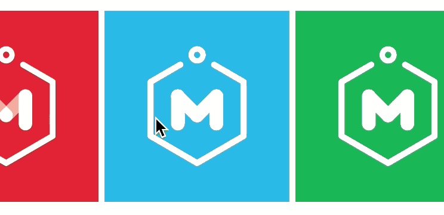
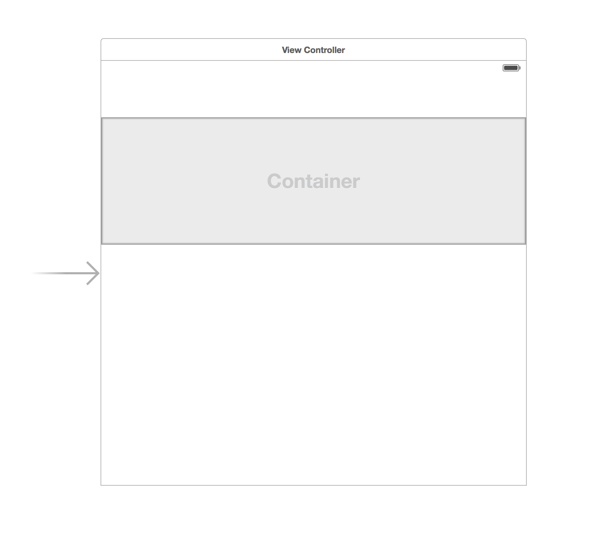
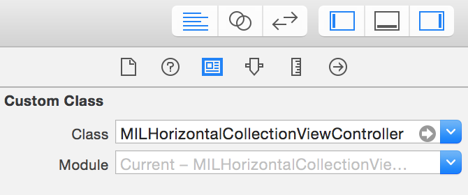
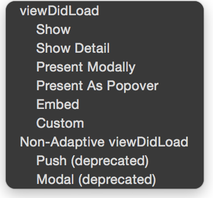
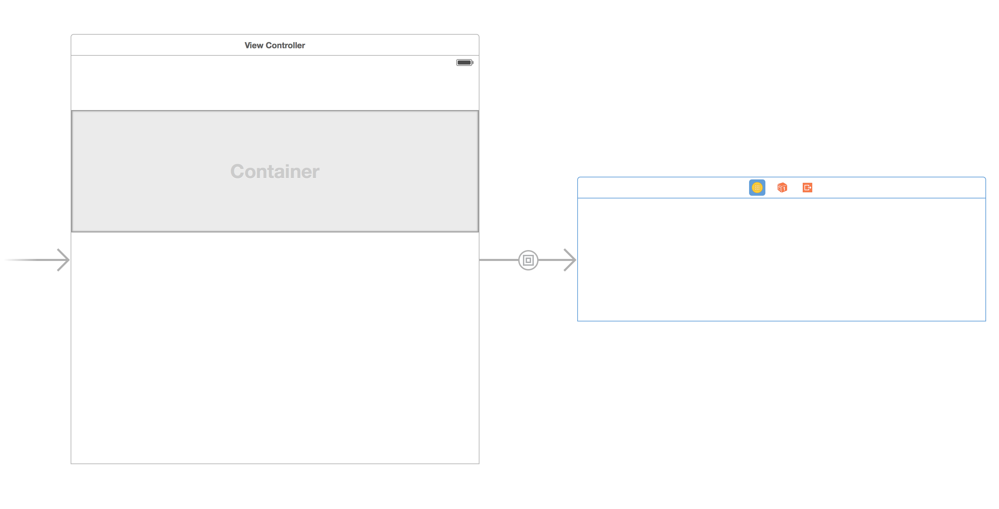
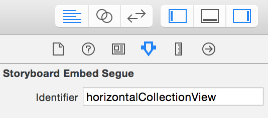

MILHorizontalCollectionView
=======================
<br>

<p align="center">
</p>

<br>
MILHorizontalCollectionView is an easy to use, drop-in, reusable UI component built in Swift to display in a horizontal row, collection view cells that are horizontally scrollable. When the collection view scrolls, it has momentum that allows it to continue to scroll and always land on a full collection view cell (without partially cropping a cell off screen). The collection view can be customized to handle and display any type of data after some minor changes (explained below). By default, the collection view is writen to display images in each cell.

While the MILHorizontalCollectionView is fully functional out the the box, I suspect you will have to modify it to some extent to match your app's UI design.

<br>

## Installation

Simply copy the **`MILHorizontalCollectionView`** **folder** into your Xcode project. This folder contains the following 4 files:

1. `MILHorizontalCollectionViewController.swift`
1. `MILHorizontalCollectionViewFlowLayout.swift`
1. `MILHorizontalCollectionViewCell.swift`
1. `MILHorizontalCollectionViewCell.xib`

<br>
## Adding MILHorizontalCollectionView To A View Controller

For both storyboard and programatic implementations, open the `ViewController.swift`file in the example xcode project to see an example in context.

<br>
### Programatic Implementation 

1. In the view controller class file you would like to add a programatic MILHorizontalCollectionViewController to, create a property at the top of the file:

	```swift
	var programaticHorizontalCollectionViewController : MILHorizontalCollectionViewController!
```
    
1. To initialize an instance of MILHorizontalCollectionViewController programmatically and set it the view controllers property we do:

	```swift
	let flow = MILHorizontalCollectionViewFlowLayout()
    self.programaticHorizontalCollectionViewController = MILHorizontalCollectionViewController(collectionViewLayout: flow)
```    
    
1. To set the frame of the MILHorizontalCollectionViewController's view we do:

	```swift
	self.programaticHorizontalCollectionViewController.view.frame = CGRectMake(x: CGFloat, y: CGFloat, width: CGFloat, height: CGFloat)
```
 		
 		
1. To add the MILHorizontalCollectionViewController's view to the view controller we do:

	```swift
	self.addChildViewController(self.programaticHorizontalCollectionViewController)
   self.programaticHorizontalCollectionViewController.didMoveToParentViewController(self)
    self.view.addSubview(self.programaticHorizontalCollectionViewController.view)
```

<br>
### Storyboard Implementation

1. On the view controller you would like to add the MILHorizontalCollectionView to, add a `Container View` to the view controller's view and delete `UIViewController` storyboard auto embeded in the container view. Add the appropriate autolayout constraints to the container view so that it displays to your liking within the view controller's view. The height you make the container view will define the height of the MILHorizontalCollectionView as well as the collection view cells in the MILHorizontalCollectionView. Your storyboard should now look like this: <p align="center">
</p>
1. Next add a `UICollectionViewController` to the storyboard. Select this collection view controller on storyboard so that it's highlighted and then select the `Identity Inspector` of the `Utilies` sidebar. Under "Custom Class" make the UICollectionViewController a subclass of `MILHorizontalCollectionViewController`<p align="center">
</p>
1. Hold down the control key while you click and drag from the container view on the view controller to the UICollectionViewController. A dialog box will show asking you what kind of segue you would like to choose, select `embed`.<p align="center">
</p>Your storyboard should now look like this:<p align="center">
</p>
1. Select the segue arrow that was just added that goes from the Container View to the MILHorizontalCollectionViewController. In the `Attributes Inspector` change the `Storyboard Embed Segue Identifier` to  `horizontalCollectionView`.<p align="center">
</p>
1. Go to the swift file that represents the UIViewController that has the Container View you added. Create a property at the top of the file 

	```swift
	var storyboardHorizontalCollectionView : MILHorizontalCollectionViewController!
	```
        
1. Add a prepare for segue method to your view controller if it isn't already added and add the following lines to get the instance of the `MILHorizontalCollectionViewController` you added on the storyboard and to save this instance to the view controller's storyboardHorizontalCollectionView property

	```swift
	override func prepareForSegue(segue: UIStoryboardSegue, sender: AnyObject?) {
 	   if(segue.identifier == "horizontalCollectionView"){
 	   		self.storyboardHorizontalCollectionView = 
      		segue.destinationViewController as! MILHorizontalCollectionViewController
    	}
	}
	```           
        
<br>    
## Usage
<br>
###Set Placeholder Cell Image and Number of Placeholder Cells       
    
A placeholder cell is a cell that is displayed in the MILHorizontalCollectionView while it waits to be passed data from it's parent view controller. This can be useful if there is a delay from retrieving data from a server call. Typically you would want to display enough cells in the collection view to fill up the whole collection view horizontally. It should be noted that if you dont set the number of placeholder cells, the collection view won't show up and will appear as plain white. The following code snippets can be used after you init a MILHorizontalCollectionView programmatically, or once you get reference to the storyboard MILHorizontalCollectionView in the prepareForSegue method. (Examples shown in the example project)

To set the placeholder item image to a locally stored image within the Xcode project, we pass it the name:

```	swift
self.storyboardHorizontalCollectionView.localPlaceHolderImageName = "placeholder_name"
```
	
To set the number of placeholder items displayed we do:
		
```swift
self.storyboardHorizontalCollectionView.setUpWithInitialPlaceHolderItems(n)
```	
	
<br>	
###Passing Data to the MILHorizontalCollectionViewController
		
By default, the MILHorizontalCollectionViewController expects to handle an array of strings that represent a URL, with its built in asychronous image url downloading and caching mechanisms. However, it should be noted that it also supports handling image url strings using the sdWebImage framework. In addition, the MILHorizontalCollectionViewController can handle an array of strings that represent names of locally stored images in the Xcode project.  
<br>

- To pass an array of `image url strings` to the collection view and have the collection view handle this using its **built in asychronous image url downloading and caching** we can do:

	```	swift
	self.horizontalCollectionView.setToHandleImageURLStrings()
		    
	let imageURLArray = [String]()
	//populate this array with url strings
		    
	//pass array of strings that represent URLs of images
	self.horizontalCollectionView.refresh(imageURLArray)
	
	```
<br>		    
- To pass an array of `image url strings` to the collection view and have the collection view handle this using the **sdWebImage** framework we can do

	```	swift	
	self.setToHandleImageURLStringsUsingSDWebImage()
	 		
	let imageURLArray = [String]()
	//populate this array with url strings
		    
	//pass array of strings that represent URLs of images
	self.storyboardHorizontalCollectionView.refresh(imageNameArray)
	
	```
<br>
- To pass an array of `strings that represent locally stored images` to the collection view we can do:

	```swift
	self.setToHandleLocalImageNameStrings()
	 		
	let imageNameArray = [String]()
	//populate this array with locally stored image names
		    
	//pass array of strings that represent names of locally stored images 
	self.storyboardHorizontalCollectionView.refresh(imageNameArray)
	```

<br>
## Customizing MILHorizontalCollectionViewController
<br>
###Changing the Height and Width of the Collection View Cells

- The `height` of a collection view cell changes with respect to the collection view controller's view height. 
	- If you are dealing with a programmatic implementation of the MILHorizontalCollectionViewController, know that when you set the frame of the collection view controller's view, this will also be the height of each cell in the collection view
	- If you are dealing with a storyboard implementation of the MILHorizontalCollectionViewController, changing the height of the container view that holds the collection view controller will also set the height of each cell in the collection view
- The `width` of the collection view cell is set by the `kViewSizeWidth` property in the `MILHorizontalCollectionViewFlowLayout.swift` file. By default it is set to `160`

<br>
###Changing the Kind of Data the Collection View Can Handle

To change the kind of data the collection view can handle, first you will need to modify the dataArray property in the `MILHorizontalCollectionViewController.swift` file to be an array of different data types:

```swift
var dataArray : [MyDataObject] = []

```

As well you will need to change the way the collection view controller prepares the cell in the cellForItemAtIndexPath method

```swift
override func collectionView(collectionView: UICollectionView, cellForItemAtIndexPath indexPath: NSIndexPath) -> UICollectionViewCell {

        let cell = collectionView.dequeueReusableCellWithReuseIdentifier("horizontalcell", forIndexPath: indexPath) as! MILHorizontalCollectionViewCell
        
        //set up cell with method that sets up the cell with a custom data object
        return self.setUpCellWithCustomDataObject(cell, indexPath: indexPath)

    }
```

<br>
###Changing the Collection View Cell's UI

To change the UI of the collection view cell, you can do this by modifying the `MILHorizontalCollectionViewCell.xib` file. By default, the collection view cell only has an image view that stretches accross the whole cell. Of course, with modifying the collection view cell's UI, comes changing the way we prepare and set up the data in the cell using the cellForItemAtIndexPath method.

<br>
## Requirements
* MILHorizontalCollectionViewController has only been tested to work with iOS 9+ and Xcode 7.1.1

## Author

Created by [Alex Buck](https://www.linkedin.com/in/alexanderbuck)
 at the [IBM Mobile Innovation Lab](http://www-969.ibm.com/innovation/milab/)

## License

MILHorizontalCollectionViewController is available under the Apache 2.0 license. See the LICENSE file for more info.

## Sample App License
The MILHorizontalCollectionViewExample sample application is available under the Apple SDK Sample Code License. Details in the file called `SAMPLE_APP_LICENSE` under the Example directory.

